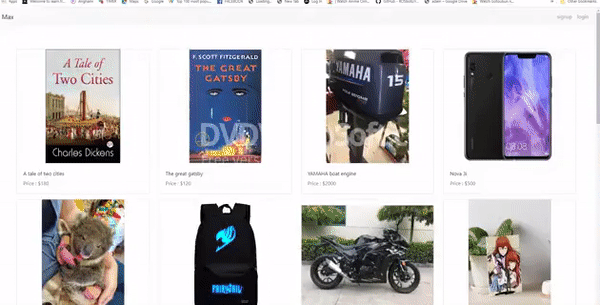

# MaxStore
This a store where the the user can buy and sell his products and also follow other user and have feed about their new products and status, the payment is handled by the the buyer and the seller, where the buyer can contact the seller from his profile information page.

# Getting Started
npm run react-dev
npm run server-dev

# demo

# Prerequisites
webpack
bcryptjs
body-parser
express
jsonwebtoken
lodash
mongoose
multer
passport
passport-jwt
react
react-dom
react-router-dom
reactstrap
webpack-cli
nodemon

# Installing
npm i webpack
npm i bcryptjs
npm i body-parser
npm i express
npm i jsonwebtoken
npm i lodash
npm i mongoose
npm i multer
npm i passport
npm i passport-jwt
npm i react
npm i react-dom
npm i react-router-dom
npm i reactstrap
npm i nodemon
npm i webpack-cli

# Deployment
we deployed it on heroku, this is the link :

# Built With
Reactjs.
Mongodb.
Express.
Nodejs.

# Authors
Ahmed .
Hamza.
Omar.
Abdlrrahman Shibani.

# Inspiration
opensooqe.
